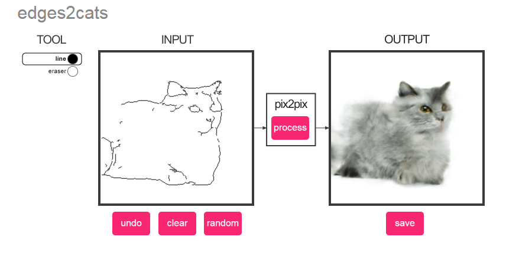
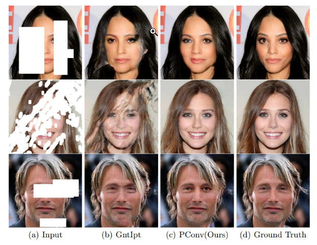
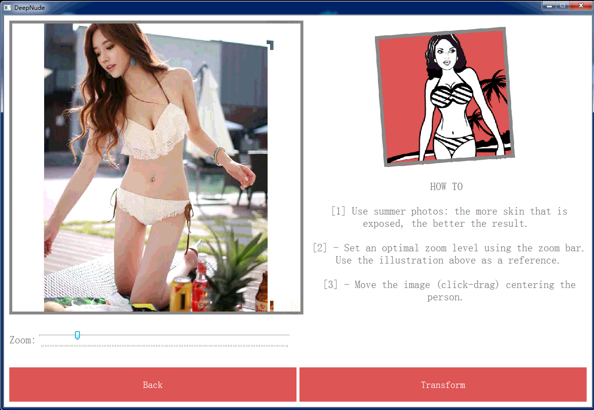

# DeepNude-an-Image-to-Image-technology
> Reprinted to indicate the source 转载注明出处 https://github.com/yuanxiaosc/DeepNude-an-Image-to-Image-technology

erasing image background 清除图像背景

Next I will open up some image/text/random-to-image neural network models and utilities for learning and communication, and also welcome to share your technical solutions.

接下来我会开源一些image/text/random-to-image的神经网络模型和实用工具，仅供学习交流之用，也欢迎分享你的技术解决方案。

## [Image-to-Image Demo](https://affinelayer.com/pixsrv/) [图像到图像demo](https://affinelayer.com/pixsrv/)
> Stick figure to colorful cats/shoes/handbags demo 简笔画到色彩丰富的猫、鞋、手袋 demo

DeepNude software mainly uses Image-to-Image technology, which theoretically converts the images you enter into any image you want. You can experience Image-to-Image technology in your browser by clicking Image-to-Image Demo below.

DeepNude 软件主要使用了Image-to-Image技术，该技术理论上可以把你输入的图片转换成任何你想要的图片。你可以点击下方的Image-to-Image Demo在浏览器中体验Image-to-Image技术。

[Image-to-Image Demo](https://affinelayer.com/pixsrv/)

An example of using this demo is as follows：

In the left side box, draw a cat as you imagine, and then click the pix 2 pix button, you can output a model generated cat.

在左侧框中按照自己想象画一个简笔画的猫，再点击pix2pix按钮，就能输出一个模型生成的猫。

## DeepNude Technology Research

This section describes DeepNude-related AI/Deep Learning theory (especially computer vision) research. If you like to read the paper and use the latest papers, enjoy it.

这一部分阐述DeepNude相关的人工智能/深度学习理论（特别是计算机视觉）研究，如果你喜欢阅读论文使用最新论文成果，尽情享用吧。

### 1. Image Inpainting 图像修复

+ 论文 NVIDIA 2018 paper [Image Inpainting for Irregular Holes Using Partial Convolutions](https://arxiv.org/abs/1804.07723) and [Partial Convolution based Padding](https://arxiv.org/abs/1811.11718).
+ 代码 Paper code [partialconv](https://github.com/NVIDIA/partialconv)。

**效果**

In the image interface of [Image_Inpainting(NVIDIA_2018).mp4](https://github.com/yuanxiaosc/DeepNude-an-Image-to-Image-technology/raw/master/Image_Inpainting(NVIDIA_2018).mp4) video, you only need to use tools to simply smear the unwanted content in the image. Even if the shape is very irregular, NVIDIA's model can “restore” the image with very realistic The picture fills the smeared blank. It can be described as a one-click P picture, and "no ps traces."
The study was based on a team from Nvidia's Guilin Liu et al. who published a deep learning method that could edit images or reconstruct corrupted images, even if the images were worn or lost pixels. This is the current 2018 state-of-the-art approach.

在 [Image_Inpainting(NVIDIA_2018).mp4](https://github.com/yuanxiaosc/DeepNude-an-Image-to-Image-technology/raw/master/Image_Inpainting(NVIDIA_2018).mp4) 视频中左侧的操作界面，只需用工具将图像中不需要的内容简单涂抹掉，哪怕形状很不规则，NVIDIA的模型能够将图像“复原”，用非常逼真的画面填补被涂抹的空白。可谓是一键P图，而且“毫无ps痕迹”。
该研究来自Nvidia的Guilin Liu等人的团队，他们发布了一种可以编辑图像或重建已损坏图像的深度学习方法，即使图像穿了个洞或丢失了像素。这是目前2018 state-of-the-art的方法。

### 2. Image-to-Image or Pix2Pix (need for paired train data)

> DeepNude mainly uses this Image-to-Image(Pix2Pix) technology.

+ 论文 Berkeley 2017 paper [Image-to-Image Translation with Conditional Adversarial Networks](https://arxiv.org/abs/1611.07004).
+ 主页 homepage [Image-to-Image Translation with Conditional Adversarial Nets](https://phillipi.github.io/pix2pix/)
+ 代码 code [pix2pix](https://github.com/phillipi/pix2pix)
+ Run in Google Colab [pix2pix.ipynb](https://github.com/tensorflow/docs/blob/master/site/en/r2/tutorials/generative/pix2pix.ipynb)

**效果**

[Image-to-Image Translation with Conditional Adversarial Networks](https://arxiv.org/abs/1611.07004) is a general solution for the use of conditional confrontation networks as an image-to-image conversion problem proposed by the University of Berkeley.

[Image-to-Image Translation with Conditional Adversarial Networks](https://arxiv.org/abs/1611.07004) 是伯克利大学研究提出的使用条件对抗网络作为图像到图像转换问题的通用解决方案。

### 3. CycleGAN (without the need for paired train data)

+ 论文 Berkeley 2017 paper [Unpaired Image-to-Image Translation using Cycle-Consistent Adversarial Networks](https://arxiv.org/abs/1703.10593)
+ 代码 code [CycleGAN](https://github.com/junyanz/CycleGAN)
+ Run in Google Colab [cyclegan.ipynb](https://github.com/tensorflow/docs/blob/master/site/en/r2/tutorials/generative/cyclegan.ipynb)

**效果**

CycleGAN uses a cycle consistency loss to enable training without the need for paired data. In other words, it can translate from one domain to another without a one-to-one mapping between the source and target domain.
This opens up the possibility to do a lot of interesting tasks like photo-enhancement, image colorization, style transfer, etc. All you need is the source and the target dataset.

CycleGAN使用循环一致性损失函数来实现训练，而无需配对数据。 换句话说，它可以从一个域转换到另一个域，而无需在源域和目标域之间进行一对一映射。
这开启了执行许多有趣任务的可能性，例如照片增强，图像着色，样式传输等。您只需要源和目标数据集。

horse2zebra 马变斑马

## DeepNude software itself

**After researching DeepNude technology, I have removed data related to DeepNude. Please don't ask me to get DeepNude program.**

### DeepNude's technology stack

+ [Python](https://www.python.org/) + PyQt 
+ [pytorch](https://pytorch.org/)
+ Deep Computer Vision

### Windows version of DeepNude use process

> DeepNude can really achieve the purpose of Image-to-Image, and the generated image is more realistic.

Delete the color.cp36-win_amd64.pyd file in the deepnude root directory, and then add the [color.py](color.py) file to get the advanced version of deepnude.

### What can be improved?

**DeepNude software shortcomings**

1. Size. Including 156M DeepNude_Windows_v2.0.0.zip and 1.90G pyqtlib.rar;
2. Speed. It takes 30 seconds to convert a picture;
3. Content. Use the Image-to-Image neural network to automatically remove the clothes from women to reveal their nudity. This application applies the wrong application of deep learning.

**Where DeepNude can be improved**

+ DeepNude can be implemented using [Tensorflow](https://www.tensorflow.org/) and uses model compression techniques. 
+ DeepNude should change the current practice of not respecting women.

## Future

In fact, we don't need Image-to-Image. We can use [GANs](https://arxiv.org/abs/1406.2661) to generate images directly from random values or generate images from text.

### 1. [Obj-GAN](https://github.com/jamesli1618/Obj-GAN) 

The new AI technology Obj-GAN developed by Microsoft Research AI understands natural language descriptions, sketches, composite images, and then refines the details based on individual words provided by sketch frames and text. In other words, the network can generate images of the same scene based on textual descriptions that describe everyday scenes.

微软人工智能研究院（Microsoft Research AI）开发的新 AI 技术Obj-GAN可以理解自然语言描述、绘制草图、合成图像，然后根据草图框架和文字提供的个别单词细化细节。换句话说，这个网络可以根据描述日常场景的文字描述生成同样场景的图像。

**效果**

**模型**

### 2. [StoryGAN](https://github.com/yitong91/StoryGAN)

[Advanced version of the pen: just one sentence, one story, you can generate a picture](https://www.microsoft.com/en-us/research/blog/a-picture-from-a-dozen-words-a-drawing-bot-for-realizing-everyday-scenes-and-even-stories/).
> Microsoft's new research proposes a new GAN, ObjGAN, which can generate complex scenes based on textual descriptions. They also proposed another GAN, StoryGAN, which can draw a story. Enter the text of a story and output the "picture book".

[进阶版神笔：只需一句话、一个故事，即可生成画面](https://www.jiqizhixin.com/articles/2019-06-29)
> 微软新研究提出新型 GAN——ObjGAN，可根据文字描述生成复杂场景。他们还提出另一个可以画故事的 GAN——StoryGAN，输入一个故事的文本，即可输出「连环画」。

当前最优的文本到图像生成模型可以基于单句描述生成逼真的鸟类图像。然而，文本到图像生成器远远不止仅对一个句子生成单个图像。给定一个多句段落，生成一系列图像，每个图像对应一个句子，完整地可视化整个故事。

**效果**

-----

**Researchers should work to improve human well-being, not to gain income through breaking the law.**.

The most commonly used image-to-image technology should be Beauty App, so why don't we develop a smarter Beauty Camera?

现在用得最多的Image-to-Image技术应该就是美颜APP了，所以我们为什么不开发一个更加智能的美颜相机呢？